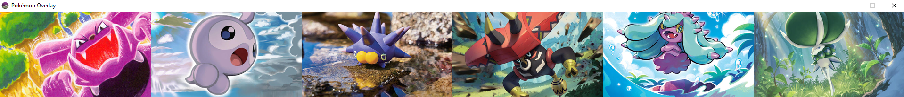
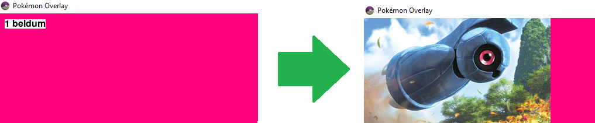
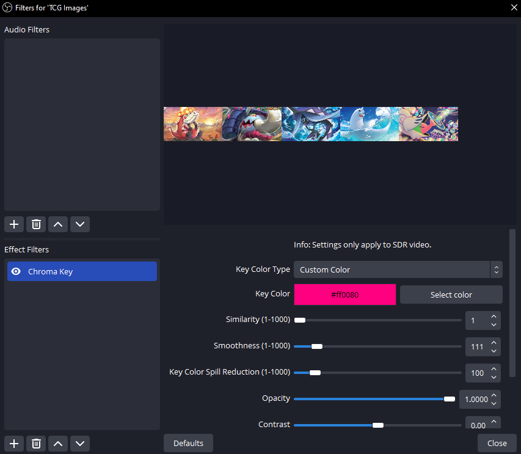

# Pokémon Overlay

This app lets you showcase your party Pokémon with art from the TCG for use in broadcasting software.

## Setup
This app was built using Python 3.12.
- Download the card art here: https://drive.google.com/file/d/12OxKjOa3NmDUt2yFM7HZ28E7sQ7uEecP/view?usp=drive_link
- Extract and place the `rsc/` folder you just downloaded into the root directory of this project.
- Create and activate a virtual environment in the root directory of this project
- `pip install -r requirements.txt`
- `python pkmn_overlay.py`
    
## Controls

### Adding Pokémon
Type the slot number (1-6), followed by a space, and the name of the Pokémon:

`1 beldum`

### Removing Pokémon
Type the slot of the Pokémon you'd like to remove, followed by a space, and then the letter 'x':

`1 x`

#### Removing All
You can also remove all Pokémon from the layout by entering 'clear':

`clear`

### Change Card Image
[!WARNING]
This does nothing on the minimal version as you only have one card per Pokémon

Sometimes the card doesn't look the best for a particular Pokémon, to get the next available card, type the slot of the Pokémon, followed by a space, and then the letter 'r':

`1 r`

### Layout Controls
- F1 - **2x3**
- F2 - **3x2**
- F3 - **6x1**
- F4 - **1x6**
- TAB - **Removes gaps in layout**

## Streaming Setup
- Add a window capture of Pokémon Overlay to your sources. Use `#ff0080`/`rgb(255,0,128)` for your chroma key color.

# Building Exe
[!WARNING]
Windows likes to flag the exes as viruses, you may have to make an exception for them.

To build the exe's, first we need to install the requirements:

`pip install -r requirements.txt`

Then for a minimal build (1 of each card):

`pyinstaller --distpath dist_minimal --workpath build_minimal build_minimal.spec`

Or for a full build (Up to 5 of each card):

`pyinstaller --distpath dist --workpath build build.spec`

# Special Mentions
Card images sourced from https://pkmncards.com/ <3
